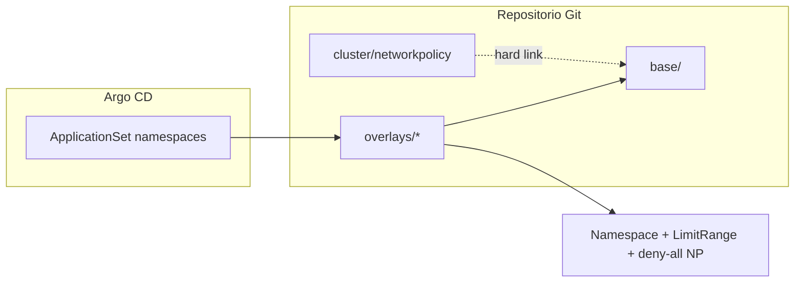

# Argo CD + Kustomize: namespaces del workshop

GitOps para provisionar namespaces en OpenShift con **Kustomize** (base común + overlays por namespace) y sincronizarlos con **Argo CD**. Los manifiestos de Argo CD (`AppProject`, `ApplicationSet`) se documentan aquí; no hay scripts ni ficheros `.yaml` de Argo en el repositorio.

**Estado**: solo estructura en Git; no aplicar al clúster hasta revisar políticas de red y overlays.

## Estructura

```
argocd-namespaces/
├── README.md
├── cluster/                              # Definición canónica de políticas de red
│   ├── kustomization.yaml                # Sin resources (no Application cluster aún)
│   └── networkpolicy-deny-all-traffic.yaml
├── base/                                 # Políticas comunes por namespace
│   ├── kustomization.yaml
│   ├── limitrange-default.yaml             # referencia desarrollo (hard link en overlay)
│   └── networkpolicy-deny-all-traffic.yaml   # hard link → ../cluster/...
└── overlays/                             # Un directorio = un namespace
    ├── desarrollo/
    ├── qa/
    └── produccion/
```

| Capa | Contenido |
|------|-----------|
| `cluster/` | Manifiesto **canónico** `deny-all-traffic` (igual que `compliance-operator/networkpolicies/02-deny-all-traffic.yaml`). No se sincroniza solo: `NetworkPolicy` es namespaced. |
| `base/` | `NetworkPolicy` deny-all (enlace al YAML de `cluster/`). Sin `Namespace`. |
| `overlays/<nombre>/` | `Namespace`, `LimitRange` y `ResourceQuota` alineados por entorno. |

No hay `RoleBinding` ni referencias a `admin-sin-lectura-secrets` en este árbol (RBAC fuera de Argo CD).

## Política de red deny-all

Equivalente a `/opt/compliance-operator/networkpolicies/02-deny-all-traffic.yaml`:

- `podSelector: {}` → todos los pods del namespace
- `policyTypes: [Ingress]` → deniega tráfico entrante (default deny)

Se aplica en **cada namespace** gestionado por los overlays, porque Kubernetes no admite `NetworkPolicy` cluster-scoped con este API. El fichero maestro vive en `cluster/`; `base/` lo incluye mediante **hard link** (Kustomize no permite `resources` fuera del directorio).

## Flujo



1. (Opcional, futuro) Application de `cluster/` solo si añades recursos cluster-scoped.
2. **ApplicationSet** genera una **Application** por subcarpeta de `overlays/`.
3. Cada Application ejecuta `kustomize build overlays/<nombre>/` (incluye `base/` → `deny-all-traffic` en ese namespace).

## Añadir un namespace

1. Crear `overlays/mi-nuevo-namespace/`.
2. Añadir `namespace.yaml` con `metadata.name: mi-nuevo-namespace`.
3. Crear `kustomization.yaml` con `resources: [namespace.yaml, ../../base]` y `namespace: mi-nuevo-namespace`.
4. Opcional: YAML extra solo de ese namespace.
5. Commit y push; el ApplicationSet crea la Application.

Validación local (sin aplicar al clúster):

```bash
kubectl kustomize /opt/workshop/automatizacion-namespace/argocd-namespaces/overlays/desarrollo
kubectl kustomize /opt/workshop/automatizacion-namespace/argocd-namespaces/overlays/qa
kubectl kustomize /opt/workshop/automatizacion-namespace/argocd-namespaces/overlays/produccion
```

## Repositorio Git

Sustituye `REPO_URL` y `TARGET_REVISION` por tu remoto y rama.

Ruta asumida: `workshop/automatizacion-namespace/argocd-namespaces/`

---

## Manifiestos Argo CD (copiar y adaptar)

### AppProject

```yaml
apiVersion: argoproj.io/v1alpha1
kind: AppProject
metadata:
  name: workshop-namespaces
  namespace: openshift-gitops
spec:
  description: Namespaces y políticas del workshop automatizacion-namespace
  sourceRepos:
    - REPO_URL
  destinations:
    - namespace: '*'
      server: https://kubernetes.default.svc
  namespaceResourceWhitelist:
    - group: ''
      kind: Namespace
    - group: ''
      kind: LimitRange
    - group: ''
      kind: ResourceQuota
    - group: networking.k8s.io
      kind: NetworkPolicy
```

### ApplicationSet — un Application por overlay

```yaml
apiVersion: argoproj.io/v1alpha1
kind: ApplicationSet
metadata:
  name: workshop-namespaces
  namespace: openshift-gitops
spec:
  goTemplate: true
  goTemplateOptions: ["missingkey=error"]
  generators:
    - git:
        repoURL: REPO_URL
        revision: TARGET_REVISION
        directories:
          - path: workshop/automatizacion-namespace/argocd-namespaces/overlays/*
  template:
    metadata:
      name: 'ns-{{.path.basename}}'
      labels:
        workshop.openshift.io/etapa: automatizacion-namespace
    spec:
      project: workshop-namespaces
      source:
        repoURL: REPO_URL
        targetRevision: TARGET_REVISION
        path: '{{.path.path}}'
      destination:
        server: https://kubernetes.default.svc
        namespace: '{{.path.basename}}'
      syncPolicy:
        automated:
          prune: true
          selfHeal: true
        syncOptions:
          - CreateNamespace=false
```

### Application manual (un namespace)

```yaml
apiVersion: argoproj.io/v1alpha1
kind: Application
metadata:
  name: ns-desarrollo
  namespace: openshift-gitops
spec:
  project: workshop-namespaces
  source:
    repoURL: REPO_URL
    targetRevision: TARGET_REVISION
    path: workshop/automatizacion-namespace/argocd-namespaces/overlays/desarrollo
  destination:
    server: https://kubernetes.default.svc
    namespace: desarrollo
  syncPolicy:
    automated:
      selfHeal: true
    syncOptions:
      - CreateNamespace=false
```

## Orden de despliegue recomendado (cuando aplique)

1. `AppProject` `workshop-namespaces`
2. `ApplicationSet` `workshop-namespaces` (o Applications manuales)
3. Comprobar en cada namespace: `LimitRange`, `NetworkPolicy` `deny-all-traffic`

## Personalización

| Ámbito | Cómo |
|--------|------|
| Todos los namespaces | Editar `cluster/networkpolicy-deny-all-traffic.yaml` (y el hard link en `base/` apunta al mismo inode) o `base/limitrange-default.yaml` |
| Un namespace | Añadir YAML en `overlays/<nombre>/` |

Para permitir tráfico tras deny-all, añade políticas adicionales en el overlay (p. ej. patrón `03-allow-same-namespace` del compliance-operator).

## Dependencias

- CNI con soporte de `NetworkPolicy` (OpenShift SDN/OVN).
- Argo CD / OpenShift GitOps y acceso al repositorio Git.
- Hard link `base/networkpolicy-deny-all-traffic.yaml` → `cluster/networkpolicy-deny-all-traffic.yaml` (en Git cada clone puede requerir `ln` si el VCS no preserva el enlace).

## Overlays incluidos

| Overlay | Namespace en clúster | Extra respecto a `base/` |
|---------|----------------------|---------------------------|
| `desarrollo` | `desarrollo` | `ResourceQuota` (2 Deployments, CPU/mem/storage) |
| `qa` | `qa` | — |
| `produccion` | `produccion` | `ResourceQuota` |

El nombre de la carpeta en `overlays/` coincide con `metadata.name` del Namespace (requisito del ApplicationSet con generador `directories`).
