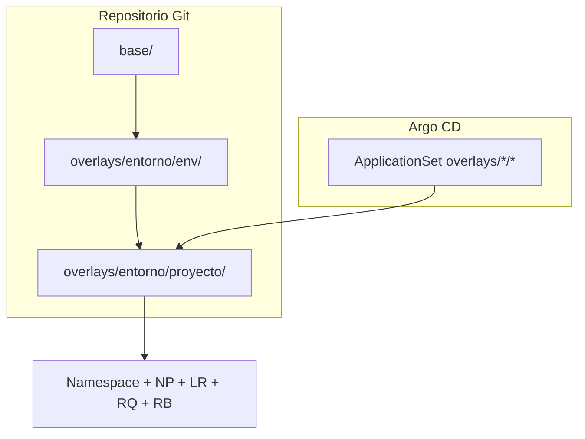

# Argo CD + Kustomize: namespaces del workshop

GitOps para provisionar **múltiples proyectos por entorno** (desarrollo, qa, producción) en OpenShift con **Kustomize** en tres capas (base general → base de entorno → proyecto) y sincronizarlos con **Argo CD**.

Los manifiestos de Argo CD (`AppProject`, `ApplicationSet`) están en `bootstrap/`; el resto del repositorio son recursos de namespace.

**Estado**: estructura en Git lista para revisión; no aplicar al clúster hasta validar políticas de red, cuotas y límites por entorno.

## Jerarquía Kustomize (3 capas)

```
base/                          ← capa 1: recursos comunes a todos los entornos
overlays/<entorno>/env/        ← capa 2: cuotas, límites y NP por entorno
overlays/<entorno>/<proyecto>/ ← capa 3: namespace del proyecto (Application Argo CD)
```

Cada proyecto referencia la base de su entorno (`../env`), que a su vez referencia la base general (`../../../base`).

## Estructura del repositorio

```
workshop-namespaces-argocd/
├── README.md
├── bootstrap/                              # ApplicationSet → openshift-gitops
│   ├── README.md
│   └── applicationset-workshop-namespaces.yaml
├── cluster/
│   ├── kustomization.yaml                  # resources: [] (referencia canónica NP)
│   └── networkpolicy-deny-all-traffic.yaml
├── base/                                   # capa 1 — común a todos los entornos
│   ├── kustomization.yaml
│   ├── networkpolicy-deny-all-traffic.yaml
│   └── rolebinding-seguridad.yaml
└── overlays/
    ├── desarrollo/
    │   ├── env/                            # capa 2 — base del entorno desarrollo
    │   │   ├── kustomization.yaml          # → ../../../base
    │   │   ├── labels/kustomization.yaml # Component: labels heredados por proyectos
    │   │   ├── limitrange.yaml
    │   │   ├── resourcequota.yaml
    │   │   └── networkpolicy-allow-same-entorno.yaml
    │   ├── demo-app/                       # capa 3 — proyecto
    │   │   ├── kustomization.yaml          # → ../env
    │   │   └── namespace.yaml
    │   └── portal/
    │       ├── kustomization.yaml
    │       └── namespace.yaml
    ├── qa/
    │   ├── env/
    │   │   └── ...
    │   └── demo-app/
    │       └── ...
    └── produccion/
        ├── env/
        │   └── ...
        └── demo-app/
            └── ...
```

| Capa | Ruta | Contenido |
|------|------|-----------|
| `cluster/` | Definición **canónica** de `NetworkPolicy` deny-all. No se despliega sola (NP es namespaced). |
| `base/` | `NetworkPolicy` deny-all y `RoleBinding` compartidos por todos los entornos. |
| `overlays/<entorno>/env/` | `LimitRange`, `ResourceQuota` y `NetworkPolicy` de comunicación interna del entorno. |
| `overlays/<entorno>/<proyecto>/` | `Namespace` del proyecto con labels de entorno y proyecto. |

## Convención de nombres

| Elemento | Convención | Ejemplo |
|----------|------------|---------|
| Carpeta del proyecto | `<proyecto>` (sin prefijo de entorno) | `demo-app`, `portal` |
| Namespace en el clúster | `<entorno>-<proyecto>` | `desarrollo-demo-app`, `qa-portal` |
| Application Argo CD | `ns-<entorno>-<proyecto>` | `ns-desarrollo-demo-app` |

El nombre del namespace debe coincidir en `namespace.yaml`, el campo `namespace:` del `kustomization.yaml` del proyecto y el destino del ApplicationSet.

## Labels para NetworkPolicy interna

Los labels del **entorno** se heredan automáticamente desde `overlays/<entorno>/env/labels/` (Kustomize Component). Cada proyecto solo declara el label de **proyecto** en su `kustomization.yaml`.

| Label | Origen | Ejemplo |
|-------|--------|---------|
| `workshop.openshift.io/entorno` | `env/labels/` (heredado) | `desarrollo` |
| `workshop.openshift.io/etapa` | `env/labels/` (heredado) | `automatizacion-namespace` |
| `app.kubernetes.io/managed-by` | `env/labels/` (heredado) | `argocd` |
| `workshop.openshift.io/proyecto` | `commonLabels` del proyecto | `demo-app` |

La base de entorno (`overlays/<entorno>/env/`) incluye `networkpolicy-allow-same-entorno.yaml`, que permite tráfico **ingress** desde cualquier namespace con el mismo label `workshop.openshift.io/entorno`. Combinada con `deny-all-traffic` de `base/`, queda:

1. **Deny-all** por defecto (ingress bloqueado).
2. **Allow same-entorno** — pods accesibles desde otros namespaces del mismo entorno.
3. Tráfico entre entornos distintos sigue bloqueado.

> **ApplicationSet**: al crear una carpeta `overlays/<entorno>/<proyecto>/`, Argo CD genera automáticamente la Application `ns-<entorno>-<proyecto>`. No hace falta editar el ApplicationSet.

## Proyectos de ejemplo incluidos

| Entorno | Proyecto | Namespace |
|---------|----------|-----------|
| `desarrollo` | `demo-app` | `desarrollo-demo-app` |
| `desarrollo` | `portal` | `desarrollo-portal` |
| `qa` | `demo-app` | `qa-demo-app` |
| `produccion` | `demo-app` | `produccion-demo-app` |

## ResourceQuota por entorno

Límites agregados del namespace (`spec.hard`). Se aplican a **cada proyecto** del entorno por igual.

### desarrollo

| Recurso | Límite |
|---------|--------|
| `count/deployments.apps` | 2 |
| `pods` | 2 |
| `requests.cpu` | 1 |
| `limits.cpu` | 2 |
| `requests.memory` | 500Mi |
| `limits.memory` | 2Gi |
| `requests.storage` | 2Gi |

### qa

| Recurso | Límite |
|---------|--------|
| `count/deployments.apps` | 20 |
| `pods` | 30 |
| `requests.cpu` | 200m |
| `limits.cpu` | 1500m |
| `requests.memory` | 500Mi |
| `limits.memory` | 5Gi |
| `requests.storage` | 5Gi |

### produccion

| Recurso | Límite |
|---------|--------|
| `count/deployments.apps` | 50 |
| `pods` | 50 |
| `requests.cpu` | 200m |
| `limits.cpu` | 2 |
| `requests.memory` | 500Mi |
| `limits.memory` | 5Gi |
| `requests.storage` | 12Gi |

## LimitRange por entorno

Los `LimitRange` fijan **defaults** y **máximos por contenedor/pod/PVC**. QA y producción no comparten un único `LimitRange` en `base/` porque sus cuotas difieren.

### desarrollo

| Tipo | defaultRequest | default | max | min |
|------|----------------|---------|-----|-----|
| Container | 500m CPU, 250Mi mem | 1 CPU, 1Gi mem | 1 CPU, 1Gi mem | 100m CPU, 128Mi mem |
| Pod | — | — | 2 CPU, 2Gi mem | — |
| PVC | — | — | 2Gi | 500Mi |

### qa

| Tipo | defaultRequest | default | max | min |
|------|----------------|---------|-----|-----|
| Container | 5m CPU, 16Mi mem | 50m CPU, 256Mi mem | 1500m CPU, 5Gi mem | 5m CPU, 16Mi mem |
| Pod | — | — | 1500m CPU, 5Gi mem | — |
| PVC | — | — | 5Gi | 1Gi |

### produccion

| Tipo | defaultRequest | default | max | min |
|------|----------------|---------|-----|-----|
| Container | 4m CPU, 10Mi mem | 50m CPU, 256Mi mem | 2 CPU, 5Gi mem | 40m CPU, 100Mi mem |
| Pod | — | — | 2 CPU, 5Gi mem | — |
| PVC | — | — | 12Gi | 1Gi |

## Flujo GitOps



1. **ApplicationSet** (generador `git` en `overlays/*/*`, excluyendo `overlays/*/env`) crea una **Application** por proyecto.
2. Cada Application ejecuta `kustomize build overlays/<entorno>/<proyecto>/`.
3. La carpeta `env/` no genera Application propia; es la base intermedia de Kustomize.

## Añadir un proyecto a un entorno existente

1. Crear `overlays/<entorno>/<proyecto>/`.
2. Añadir `namespace.yaml` (solo nombre y anotaciones; **sin labels de entorno**):

```yaml
apiVersion: v1
kind: Namespace
metadata:
  name: <entorno>-<proyecto>
  annotations:
    openshift.io/description: Descripción del proyecto
    openshift.io/display-name: Nombre visible
```

3. Crear `kustomization.yaml` (hereda labels del entorno vía `../env/labels`):

```yaml
apiVersion: kustomize.config.k8s.io/v1beta1
kind: Kustomization

components:
  - ../env/labels

resources:
  - namespace.yaml
  - ../env

namespace: <entorno>-<proyecto>

commonLabels:
  workshop.openshift.io/proyecto: <proyecto>
```

4. Commit y push; el ApplicationSet crea la Application `ns-<entorno>-<proyecto>`.

No hace falta tocar el ApplicationSet ni `env/labels/`: detecta automáticamente carpetas nuevas bajo `overlays/*/*`.

## Añadir un entorno nuevo

1. Crear `overlays/<nuevo-entorno>/env/` copiando la estructura de un entorno existente.
2. Ajustar `limitrange.yaml`, `resourcequota.yaml` y el valor del label en `networkpolicy-allow-same-entorno.yaml`.
3. En `env/kustomization.yaml`, actualizar `commonLabels.workshop.openshift.io/entorno`.
4. Crear al menos un proyecto en `overlays/<nuevo-entorno>/<proyecto>/`.

## Validación local

```bash
kubectl kustomize overlays/desarrollo/demo-app
kubectl kustomize overlays/desarrollo/portal
kubectl kustomize overlays/qa/demo-app
kubectl kustomize overlays/produccion/demo-app
```

Comprobar recursos generados:

```bash
kubectl kustomize overlays/desarrollo/demo-app | grep -E '^kind:'
# Namespace, ResourceQuota, LimitRange, RoleBinding, NetworkPolicy (×2)
```

Verificar label de entorno en el namespace:

```bash
kubectl kustomize overlays/desarrollo/demo-app | grep -A5 'kind: Namespace'
```

## Repositorio Git

Remoto: [workshop-namespaces-argocd](https://github.com/alexanderbenitezbracho-web/workshop-namespaces-argocd.git), rama `main`.

## Bootstrap Argo CD

El **ApplicationSet** está en `bootstrap/applicationset-workshop-namespaces.yaml` y usa el **AppProject `seguridad`** en `openshift-gitops`.

```bash
oc apply -f bootstrap/applicationset-workshop-namespaces.yaml -n openshift-gitops
```

Detalle en [bootstrap/README.md](bootstrap/README.md).

## Personalización

| Objetivo | Dónde editar |
|----------|----------------|
| Deny-all en todos los entornos | `cluster/networkpolicy-deny-all-traffic.yaml` (y copia en `base/`) |
| Cuota de un entorno | `overlays/<entorno>/env/resourcequota.yaml` |
| Defaults/máximos por pod de un entorno | `overlays/<entorno>/env/limitrange.yaml` |
| Comunicación interna del entorno | `overlays/<entorno>/env/networkpolicy-allow-same-entorno.yaml` |
| Recursos solo de un proyecto | YAML extra en `overlays/<entorno>/<proyecto>/` |

Tras cambiar cuota, revisa el `LimitRange` del mismo `env/` para que `defaultRequest`/`max` no impidan usar la cuota ni la agoten con el primer pod.

## Dependencias

- CNI con soporte de `NetworkPolicy` (OpenShift SDN/OVN).
- Argo CD / OpenShift GitOps y acceso al repositorio Git.
- `base/networkpolicy-deny-all-traffic.yaml` debe mantener el mismo contenido que `cluster/networkpolicy-deny-all-traffic.yaml`.

## Orden de despliegue recomendado

1. AppProject **`seguridad`** (ya existente en el clúster)
2. `oc apply -f bootstrap/applicationset-workshop-namespaces.yaml -n openshift-gitops`
3. Por proyecto: comprobar `Namespace`, labels de entorno, `ResourceQuota`, `LimitRange`, `NetworkPolicy` deny-all y allow-same-entorno
