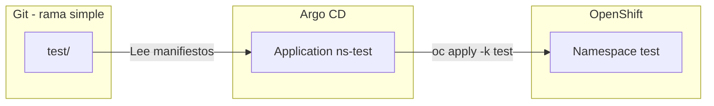

# Argo CD: automatización de namespaces en OpenShift

Ejemplo mínimo de **GitOps** con Argo CD: un repositorio Git define el namespace **test** y una sola **Application** lo sincroniza con el clúster.

**Rama:** `simple`  
**Repositorio:** [workshop-namespaces-argocd](https://github.com/alexanderbenitezbracho-web/workshop-namespaces-argocd.git)

## Estructura del repositorio

```
workshop-namespaces-argocd/
├── README.md
├── bootstrap/
│   └── application-test.yaml    # Application de Argo CD
└── test/
    ├── kustomization.yaml
    ├── namespace.yaml
    ├── rolebinding.yaml
    ├── networkpolicy.yaml
    ├── limitrange.yaml
    └── resourcequota.yaml
```

| Carpeta      | Contenido                                                         |
| ------------ | ----------------------------------------------------------------- |
| `test/`      | Manifiestos del namespace (Kustomize)                             |
| `bootstrap/` | Una **Application** que apunta a `test/` en Git                  |

## Recursos en `test/`

| Manifiesto           | Recurso       | Descripción                                               |
| -------------------- | ------------- | --------------------------------------------------------- |
| `namespace.yaml`     | Namespace     | Proyecto `test`                                           |
| `rolebinding.yaml`   | RoleBinding   | Rol `view` para el grupo `seguridad`                      |
| `networkpolicy.yaml` | NetworkPolicy | Deny-all de tráfico entrante                              |
| `limitrange.yaml`    | LimitRange    | Defaults y máximos por contenedor, pod y PVC              |
| `resourcequota.yaml` | ResourceQuota | Cupo agregado del namespace                               |

## Cómo funciona Argo CD



1. Los manifiestos viven en Git (`test/`).
2. La **Application** `ns-test` indica a Argo CD qué repo, rama y carpeta leer.
3. Argo CD ejecuta `kustomize build test/` y aplica el resultado en el clúster.
4. Con `selfHeal: true`, cualquier cambio manual en el clúster se revierte según Git.

## Aplicación manual (sin Argo CD)

```bash
cd workshop-namespaces-argocd

kubectl kustomize test
oc apply -k test
```

## Implementación con Argo CD

Requisitos: OpenShift GitOps activo (`openshift-gitops`) y acceso al repositorio Git (rama `simple`).

### 1. Validar manifiestos

```bash
kubectl kustomize test | grep -E '^kind:'
# Namespace, RoleBinding, NetworkPolicy, LimitRange, ResourceQuota
```

### 2. Crear la Application

```bash
oc apply -f bootstrap/application-test.yaml -n openshift-gitops
```

### 3. Verificar sincronización

```bash
oc get applications.argoproj.io ns-test -n openshift-gitops
```

Estado esperado: `Synced` / `Healthy`.

### 4. Verificar recursos en el clúster

```bash
oc get ns test
oc get resourcequota,limitrange,networkpolicy,rolebinding -n test
```

### 5. Consola Argo CD (opcional)

```bash
oc get route openshift-gitops-server -n openshift-gitops \
  -o jsonpath='https://{.spec.host}{"\n"}'
```

## Eliminación

La Application tiene `prune: true`: al borrarla, Argo CD elimina los recursos que gestiona.

```bash
oc delete applications.argoproj.io ns-test -n openshift-gitops
oc get ns test 2>/dev/null && oc delete ns test --wait=false
```

## Personalización

| Objetivo                 | Dónde editar                      |
| ------------------------ | --------------------------------- |
| Cuota del namespace      | `test/resourcequota.yaml`         |
| Límites por pod          | `test/limitrange.yaml`            |
| Política de red          | `test/networkpolicy.yaml`         |
| Repo o rama en Argo CD   | `bootstrap/application-test.yaml` |

Tras un cambio en Git, Argo CD sincroniza automáticamente (o pulsa **Sync** en la consola).
