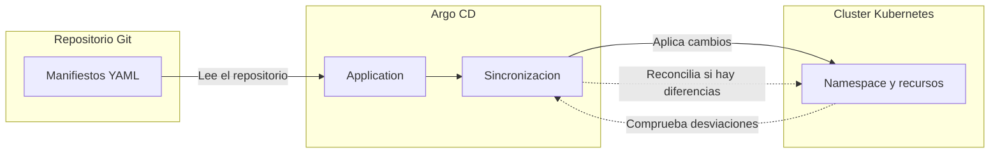
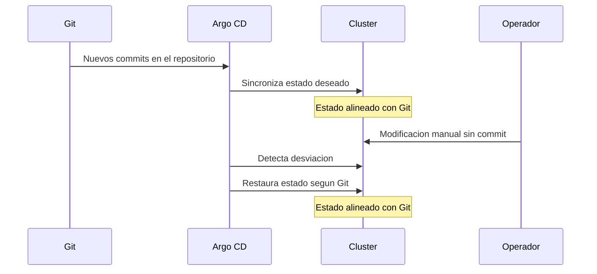
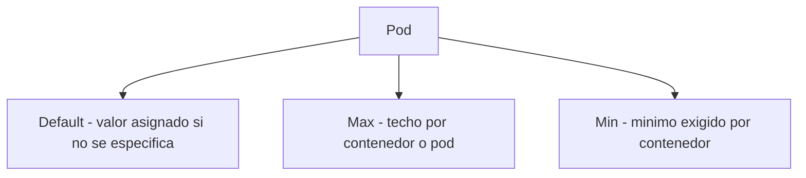
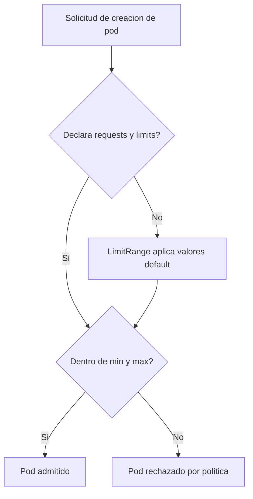
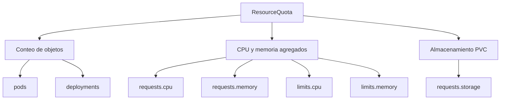
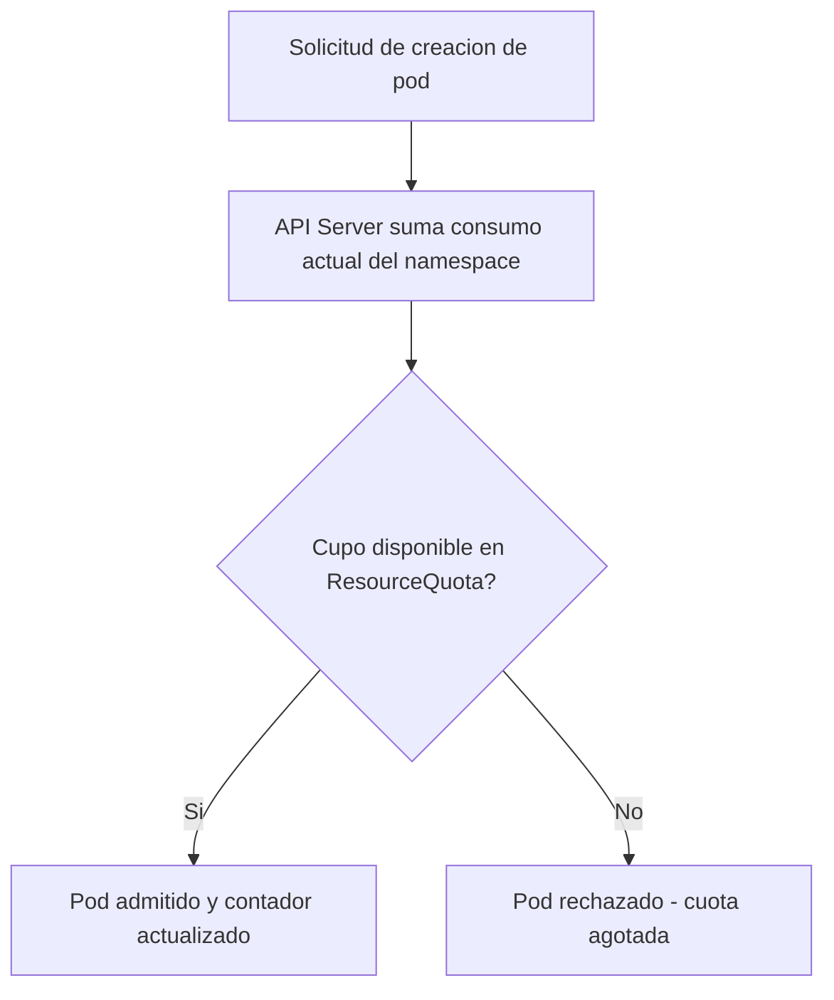
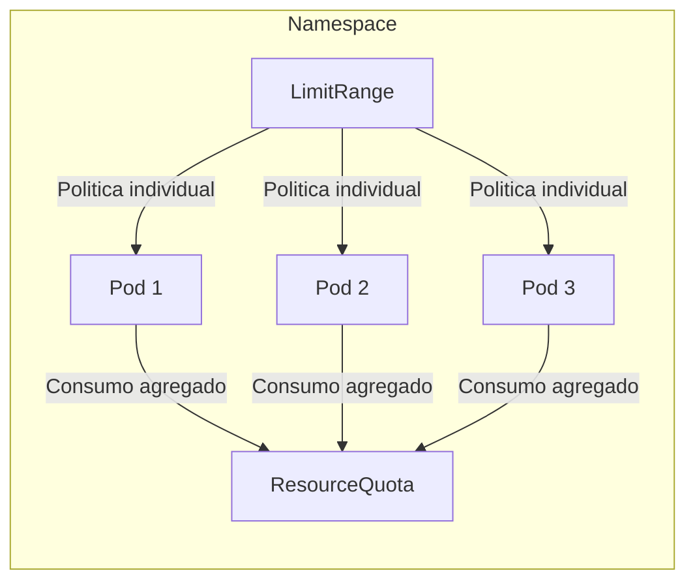
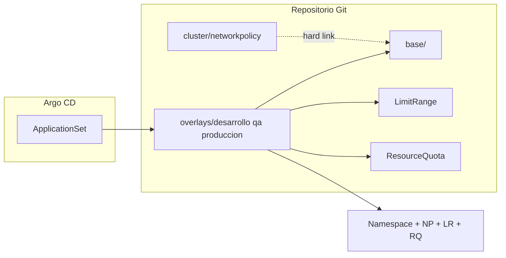

# Argo CD + Kustomize: gestión de namespaces

Este documento describe qué son Argo CD, los LimitRange y las ResourceQuota. A continuación se incluye la guía técnica para desplegar y operar el proyecto.

---

## ¿Qué es Argo CD?

En un entorno Kubernetes, el **estado deseado** de la infraestructura se define en archivos declarativos (manifiestos YAML) almacenados en un repositorio Git. Ese repositorio actúa como **fuente de verdad**: cualquier cambio en el clúster debería originarse primero en Git.

**Argo CD** es un operador de **GitOps** que automatiza la reconciliación entre el estado declarado en Git y el estado real del clúster. Su función principal es **detectar desviaciones** y **aplicar correcciones** para mantener ambos alineados.

Analogía: un **plano maestro de arquitectura** (Git) frente al **edificio construido** (clúster). Argo CD actúa como el equipo de control de calidad que compara el plano con la obra y ordena las correcciones necesarias cuando no coinciden.

```
  Fuente de verdad (Git)         Argo CD                    Clúster Kubernetes
 ┌─────────────────────┐    ┌──────────────────┐    ┌─────────────────────────┐
 │ Manifiestos YAML    │    │ Compara estado   │    │ Namespaces, pods,       │
 │ (estado deseado)    │───►│ deseado vs real  │───►│ cuotas, políticas...    │
 │                     │    │ y reconcilia     │    │ (estado actual)         │
 └─────────────────────┘    └──────────────────┘    └─────────────────────────┘
```

### Componentes principales

| Componente | Descripción |
|------------|-------------|
| **Repositorio Git** | Almacena los manifiestos que definen el estado deseado del clúster. |
| **Application** | Vincula una ruta del repositorio con un destino concreto en el clúster y gestiona su sincronización. |
| **ApplicationSet** | Plantilla que genera múltiples Applications a partir de un generador (por ejemplo, carpetas en Git). |
| **AppProject** | Delimita el alcance operativo: repositorios permitidos, destinos y tipos de recursos que Argo CD puede gestionar. |
| **Sync** | Proceso de comparación y aplicación: lee Git, calcula diferencias y ejecuta los cambios en el clúster. |

### Flujo: de Git al clúster



### Cambios manuales en el clúster

Con la política de sincronización automática habilitada, Argo CD no solo aplica cambios desde Git: también **revierte modificaciones manuales** que no estén reflejadas en el repositorio. Este comportamiento se conoce como **self-heal**.



### GitOps frente a despliegue manual

```
  Sin GitOps                          Con Argo CD (GitOps)
  ──────────                          ───────────────────

  Operador ──► Cluster                Git ──► Argo CD ──► Cluster
  Cambios ad-hoc sin                    Estado declarativo,
  trazabilidad centralizada.            auditable y reconciliado
                                        de forma continua.
```

---

## ¿Qué es un LimitRange?

Un **LimitRange** define **políticas de recursos a nivel de contenedor, pod o volumen** dentro de un namespace. Establece valores por defecto, mínimos y máximos que cada unidad de cómputo debe respetar.

Analogía: en un **centro de datos virtualizado**, cada máquina virtual tiene un perfil de tamaño asignado (por ejemplo, *small*, *medium*, *large*). El LimitRange cumple una función similar: regula cuántos recursos puede solicitar y consumir **cada contenedor individual**, independientemente del total disponible en el namespace.

```
  LimitRange — politica por unidad de computo (contenedor / pod)
  ┌────────────────────────────────────────────────────────────┐
  │  Contenedor A              Contenedor B                  │
  │  ┌──────────────────┐     ┌──────────────────┐            │
  │  │ default: 100m CPU │     │ default: 100m CPU │            │
  │  │ max:     500m CPU │     │ max:     500m CPU │            │
  │  │ min:      50m CPU │     │ min:      50m CPU │            │
  │  └──────────────────┘     └──────────────────┘            │
  └────────────────────────────────────────────────────────────┘
```

### Tipos de restricción



| Restricción | Función | Ejemplo |
|-------------|---------|---------|
| **default** | Asigna recursos cuando el manifiesto del pod no declara `requests` ni `limits`. | CPU: 100m, memoria: 128Mi |
| **max** | Impide que un contenedor o pod supere el techo definido. | Máximo 2 CPU y 4Gi por pod |
| **min** | Exige un consumo mínimo para evitar pods con asignación insignificante. | Mínimo 50m CPU por contenedor |

### Flujo de admisión con LimitRange



### Propósito operativo

Sin LimitRange, un pod podría desplegarse sin declarar recursos y consumir capacidad de forma impredecible, o solicitar cantidades desproporcionadas que impidan el reparto equitativo. El LimitRange garantiza **consistencia y previsibilidad** en la asignación de recursos por unidad de trabajo.

---

## ¿Qué es una ResourceQuota?

Una **ResourceQuota** establece el **límite agregado de recursos** que un namespace puede consumir en su conjunto. A diferencia del LimitRange — que opera por contenedor —, la ResourceQuota controla la **capacidad total del tenant**.

Analogía: un **departamento en una empresa** dispone de un presupuesto anual de infraestructura. Puede tener múltiples equipos (pods) con perfiles individuales (LimitRange), pero la suma de todos los consumos no puede superar el cupo asignado al departamento (namespace).

```
  ResourceQuota — cupo agregado del namespace
  ┌──────────────────────────────────────────────────────────┐
  │  Namespace: desarrollo                                   │
  │                                                          │
  │  Pod 1 + Pod 2 + Pod 3 + ... = consumo total            │
  │                                                          │
  │  pods:            4 / 30                                 │
  │  requests.cpu:    200m / 1                               │
  │  requests.memory: 400Mi / 500Mi                          │
  └──────────────────────────────────────────────────────────┘
```

### Ámbitos de limitación



| Tipo de límite | Descripción | Ejemplos en Kubernetes |
|----------------|-------------|------------------------|
| **Conteo de objetos** | Máximo número de recursos de un tipo en el namespace. | `pods: 30`, `count/deployments.apps: 20` |
| **CPU / memoria (requests)** | Suma de reservas de recursos de todos los pods. | `requests.cpu: 1`, `requests.memory: 500Mi` |
| **CPU / memoria (limits)** | Suma de límites superiores de todos los pods. | `limits.cpu: 2`, `limits.memory: 2Gi` |
| **Almacenamiento** | Capacidad total de volúmenes persistentes solicitados. | `requests.storage: 5Gi` |

### Flujo de admisión con ResourceQuota



### Ejemplo numérico

```
  ResourceQuota del namespace:
  ┌─────────────────────────────────────┐
  │  pods maximo:         2             │
  │  requests.cpu max:    1 nucleo      │
  │  requests.memory max: 500 Mi        │
  └─────────────────────────────────────┘

  Pod 1 activo  ->  0.5 CPU, 200 Mi
  Pod 2 activo  ->  0.5 CPU, 200 Mi
  ─────────────────────────────────────
  Total         ->  2 pods, 1 CPU, 400 Mi

  Solicitud Pod 3  ->  Rechazado: pods 2/2
```

---

## LimitRange y ResourceQuota: relación entre ambos

Ambos mecanismos operan en capas distintas pero complementarias dentro de un namespace.

Analogía: un **edificio de oficinas**. El LimitRange define la normativa por planta (capacidad máxima por sala). La ResourceQuota fija la ocupación total del edificio (número de personas y consumo agregado permitido).

```
  ┌─────────────────────────────────────────────────────────────────┐
  │  Namespace                                                      │
  │                                                                 │
  │  ResourceQuota  ->  Cupo total del namespace                    │
  │                                                                 │
  │  ┌─────────────┐  ┌─────────────┐  ┌─────────────┐             │
  │  │ Pod 1       │  │ Pod 2       │  │ Pod 3       │             │
  │  │ LimitRange  │  │ LimitRange  │  │ LimitRange  │             │
  │  │ min/max/    │  │ min/max/    │  │ min/max/    │             │
  │  │ default     │  │ default     │  │ default     │             │
  │  └─────────────┘  └─────────────┘  └─────────────┘             │
  │       Politica por contenedor                                   │
  └─────────────────────────────────────────────────────────────────┘
```



| Pregunta | Mecanismo |
|----------|-----------|
| ¿Cuánto puede consumir **este** contenedor como máximo? | **LimitRange** |
| ¿Cuánto pueden consumir **todos** los pods del namespace en conjunto? | **ResourceQuota** |
| ¿Qué ocurre si el pod no declara recursos? | **LimitRange** aplica valores por defecto |
| ¿Qué ocurre si el namespace agotó su cupo? | **ResourceQuota** rechaza nuevas solicitudes |

**Orden de evaluación:** el API Server valida primero las restricciones del LimitRange (por unidad) y después comprueba si el consumo agregado cabe dentro de la ResourceQuota (por namespace).

---

# Documentación técnica

GitOps para provisionar los namespaces **desarrollo**, **qa** y **produccion** en OpenShift con **Kustomize** (base común + overlay por entorno) y sincronizarlos con **Argo CD**.

Los manifiestos de Argo CD (`AppProject`, `ApplicationSet`) están en `bootstrap/`. El **ApplicationSet** genera automáticamente una **Application** por cada carpeta en `overlays/*`.

**Estado**: validado en clúster OpenShift con OpenShift GitOps (`openshift-gitops`). Los manifiestos Kustomize compilan y las Applications `ns-desarrollo`, `ns-qa` y `ns-produccion` sincronizan correctamente los namespaces con cuotas, límites y NetworkPolicy deny-all.

## Estructura del repositorio

```
workshop-namespaces-argocd/
├── README.md
├── bootstrap/                          # AppProject + ApplicationSet → openshift-gitops
│   ├── README.md
│   ├── appproject-seguridad.yml
│   └── applicationset-workshop-namespaces.yaml
├── cluster/
│   ├── kustomization.yaml              # resources: [] (sin Application Argo por ahora)
│   └── networkpolicy-deny-all-traffic.yaml
├── base/
│   ├── kustomization.yaml              # solo NetworkPolicy (común)
│   ├── limitrange-default.yaml         # plantilla desarrollo (hard link en overlay)
│   └── networkpolicy-deny-all-traffic.yaml   # hard link → cluster/...
└── overlays/
    ├── desarrollo/
    │   ├── kustomization.yaml
    │   ├── namespace.yaml
    │   ├── limitrange.yaml             # hard link → base/limitrange-default.yaml
    │   └── resourcequota.yaml
    ├── qa/
    │   ├── kustomization.yaml
    │   ├── namespace.yaml
    │   ├── limitrange.yaml
    │   └── resourcequota.yaml
    └── produccion/
        ├── kustomization.yaml
        ├── namespace.yaml
        ├── limitrange.yaml
        └── resourcequota.yaml
```


| Capa                  | Contenido                                                                                                                                                                              |
| --------------------- | -------------------------------------------------------------------------------------------------------------------------------------------------------------------------------------- |
| `cluster/`            | Definición **canónica** de `NetworkPolicy` deny-all (referencia: `compliance-operator/networkpolicies/02-deny-all-traffic.yaml`). No se despliega sola: `NetworkPolicy` es namespaced. |
| `base/`               | `NetworkPolicy` deny-all compartida por todos los entornos. **No** incluye `LimitRange` ni `ResourceQuota` (difieren por entorno).                                                     |
| `overlays/<entorno>/` | `Namespace`, `LimitRange` y `ResourceQuota` alineados entre sí. El nombre de la carpeta = nombre del namespace en el clúster.                                                          |


`base/rolebinding-seguridad.yaml` concede rol `view` al grupo `seguridad` en cada namespace gestionado.

## Entornos gestionados


| Overlay      | Namespace    | Recursos propios del overlay            |
| ------------ | ------------ | --------------------------------------- |
| `desarrollo` | `desarrollo` | `limitrange.yaml`, `resourcequota.yaml` |
| `qa`         | `qa`         | `limitrange.yaml`, `resourcequota.yaml` |
| `produccion` | `produccion` | `limitrange.yaml`, `resourcequota.yaml` |


Cada overlay referencia `../../base` (NetworkPolicy) y añade su `LimitRange` + `ResourceQuota`.

## ResourceQuota por entorno

Límites agregados del namespace (`spec.hard`). Documentación: [Resource Quotas](https://kubernetes.io/docs/concepts/policy/resource-quotas/).

### desarrollo


| Recurso                  | Límite |
| ------------------------ | ------ |
| `count/deployments.apps` | 2      |
| `pods`                   | 2      |
| `requests.cpu`           | 1      |
| `limits.cpu`             | 2      |
| `requests.memory`        | 500Mi  |
| `limits.memory`          | 2Gi    |
| `requests.storage`       | 2Gi    |


### qa


| Recurso                  | Límite |
| ------------------------ | ------ |
| `count/deployments.apps` | 20     |
| `pods`                   | 30     |
| `requests.cpu`           | 200m   |
| `limits.cpu`             | 1500m  |
| `requests.memory`        | 500Mi  |
| `limits.memory`          | 5Gi    |
| `requests.storage`       | 5Gi    |


### produccion


| Recurso                  | Límite |
| ------------------------ | ------ |
| `count/deployments.apps` | 50     |
| `pods`                   | 50     |
| `requests.cpu`           | 200m   |
| `limits.cpu`             | 2      |
| `requests.memory`        | 500Mi  |
| `limits.memory`          | 5Gi    |
| `requests.storage`       | 12Gi   |


## LimitRange por entorno

Los `LimitRange` fijan **defaults** y **máximos por contenedor/pod/PVC** para que los pods sin `resources` definidos no rompan la cuota. Documentación: [Limit Range](https://kubernetes.io/docs/concepts/policy/limit-range/).

**Importante**: las cuotas de QA y producción permiten muchos pods con poco CPU agregado (`requests.cpu: 200m`); por eso no comparten un único `LimitRange` en `base/`.

### desarrollo (`base/limitrange-default.yaml` = `overlays/desarrollo/limitrange.yaml`)


| Tipo      | defaultRequest      | default        | max            | min                 |
| --------- | ------------------- | -------------- | -------------- | ------------------- |
| Container | 500m CPU, 250Mi mem | 1 CPU, 1Gi mem | 1 CPU, 1Gi mem | 100m CPU, 128Mi mem |
| Pod       | —                   | —              | 2 CPU, 2Gi mem | —                   |
| PVC       | —                   | —              | 2Gi            | 500Mi               |


### qa


| Tipo      | defaultRequest   | default            | max                | min              |
| --------- | ---------------- | ------------------ | ------------------ | ---------------- |
| Container | 5m CPU, 16Mi mem | 50m CPU, 256Mi mem | 1500m CPU, 5Gi mem | 5m CPU, 16Mi mem |
| Pod       | —                | —                  | 1500m CPU, 5Gi mem | —                |
| PVC       | —                | —                  | 5Gi                | 1Gi              |


### produccion


| Tipo      | defaultRequest   | default            | max            | min                |
| --------- | ---------------- | ------------------ | -------------- | ------------------ |
| Container | 4m CPU, 10Mi mem | 50m CPU, 256Mi mem | 2 CPU, 5Gi mem | 40m CPU, 100Mi mem |
| Pod       | —                | —                  | 2 CPU, 5Gi mem | —                  |
| PVC       | —                | —                  | 12Gi           | 1Gi                |


## Política de red deny-all

- `podSelector: {}` → todos los pods del namespace
- `policyTypes: [Ingress]` → deniega tráfico entrante (default deny)

Se aplica en cada namespace vía `base/`. El fichero maestro está en `cluster/`; `base/networkpolicy-deny-all-traffic.yaml` es un **hard link** al mismo contenido (Kustomize no admite `resources` fuera del directorio del overlay).

Para permitir tráfico después del deny-all, añade `NetworkPolicy` adicionales en el overlay (p. ej. `03-allow-same-namespace` del compliance-operator).

## Flujo GitOps




1. **ApplicationSet** (generador `git` en `overlays/`*) crea una **Application** por entorno.
2. Cada Application ejecuta `kustomize build overlays/<entorno>/`.
3. La carpeta `cluster/` no se sincroniza sola (`kustomization.yaml` con `resources: []`).

## Añadir un namespace / entorno

1. Crear `overlays/<nombre>/` (el nombre debe ser el del namespace en el clúster).
2. Añadir `namespace.yaml` con `metadata.name: <nombre>`.
3. Crear `kustomization.yaml`:

```yaml
apiVersion: kustomize.config.k8s.io/v1beta1
kind: Kustomization
resources:
  - namespace.yaml
  - ../../base
  - limitrange.yaml
  - resourcequota.yaml
namespace: <nombre>
```

1. Definir `resourcequota.yaml` y `limitrange.yaml` **coherentes** (misma lógica de límites agregados vs defaults por pod).
2. Commit y push; el ApplicationSet crea la Application `ns-<nombre>`.

## Validación local

Sin aplicar al clúster:

```bash
REPO=/opt/workshop/automatizacion-namespace/workshop-namespaces-argocd

kubectl kustomize "$REPO/overlays/desarrollo"
kubectl kustomize "$REPO/overlays/qa"
kubectl kustomize "$REPO/overlays/produccion"
```

Comprobar recursos generados:

```bash
kubectl kustomize "$REPO/overlays/desarrollo" | grep -E '^kind:'
# Namespace, ResourceQuota, RoleBinding, LimitRange, NetworkPolicy
```

## Repositorio Git

Remoto: [workshop-namespaces-argocd](https://github.com/alexanderbenitezbracho-web/workshop-namespaces-argocd.git), rama `main`. La raíz del repo coincide con esta carpeta (`base/`, `cluster/`, `overlays/`, `bootstrap/`).

## Implementación paso a paso

Requisitos previos:

- OpenShift GitOps instalado (namespace `openshift-gitops` activo).
- Acceso `cluster-admin` o permisos para crear `AppProject`, `ApplicationSet` y `Application` en `openshift-gitops`.
- Repositorio Git accesible desde el clúster ([workshop-namespaces-argocd](https://github.com/alexanderbenitezbracho-web/workshop-namespaces-argocd.git), rama `main`). Si es privado, registra credenciales en Argo CD antes del sync.

### 1. Validar manifiestos Kustomize (opcional)

```bash
cd workshop-namespaces-argocd

for env in desarrollo qa produccion; do
  echo "=== overlays/$env ==="
  kubectl kustomize "overlays/$env" | grep -E '^kind:'
done
```

### 2. Crear el AppProject `seguridad`

Solo si aún no existe en `openshift-gitops`:

```bash
oc get appproject seguridad -n openshift-gitops 2>/dev/null \
  || oc apply -f bootstrap/appproject-seguridad.yml
```

### 3. Aplicar el ApplicationSet

```bash
oc apply -f bootstrap/applicationset-workshop-namespaces.yaml -n openshift-gitops
```

El ApplicationSet genera automáticamente tres Applications:


| Application     | Overlay               | Namespace destino |
| --------------- | --------------------- | ----------------- |
| `ns-desarrollo` | `overlays/desarrollo` | `desarrollo`      |
| `ns-qa`         | `overlays/qa`         | `qa`              |
| `ns-produccion` | `overlays/produccion` | `produccion`      |


### 4. Verificar Applications y sync

> En clústeres con operadores IBM, `oc get applications` puede resolver a otro CRD. Usa el recurso de Argo CD explícitamente:

```bash
oc get applicationset workshop-namespaces -n openshift-gitops
oc get applications.argoproj.io -n openshift-gitops \
  -l workshop.openshift.io/etapa=automatizacion-namespace
```

Estado esperado: `SYNC STATUS=Synced`, `HEALTH STATUS=Healthy`.

Detalle de una Application:

```bash
oc get applications.argoproj.io ns-desarrollo -n openshift-gitops -o yaml
```

### 5. Verificar recursos en los namespaces

```bash
oc get ns desarrollo qa produccion
for ns in desarrollo qa produccion; do
  echo "=== $ns ==="
  oc get resourcequota,limitrange,networkpolicy,rolebinding -n "$ns"
done
```

Recursos esperados por namespace: `ResourceQuota`, `LimitRange`, `NetworkPolicy` (`deny-all-traffic`), `RoleBinding` (`view-seguridad`).

### 6. Consola Argo CD (opcional)

```bash
oc get route openshift-gitops-server -n openshift-gitops \
  -o jsonpath='https://{.spec.host}{"\n"}'
```

Inicia sesión y confirma las Applications `ns-desarrollo`, `ns-qa` y `ns-produccion` en el proyecto `seguridad`.

---

## Eliminación paso a paso

El ApplicationSet y las Applications tienen `syncPolicy.automated.prune: true`. Al borrar las Applications, Argo CD elimina los recursos que gestiona (namespaces incluidos, vía `CreateNamespace=true`).

### 1. Eliminar el ApplicationSet (recomendado)

Borra el ApplicationSet y las Applications hijas:

```bash
oc delete applicationset workshop-namespaces -n openshift-gitops
```

Espera a que desaparezcan las Applications:

```bash
oc get applications.argoproj.io -n openshift-gitops \
  -l workshop.openshift.io/etapa=automatizacion-namespace
```

### 2. Comprobar limpieza de namespaces

Si algún namespace permanece (finalizers o recursos huérfanos):

```bash
for ns in desarrollo qa produccion; do
  oc get ns "$ns" 2>/dev/null && oc delete ns "$ns" --wait=false
done
```

### 3. Eliminar Applications manualmente (alternativa)

Si prefieres borrar una a una sin tocar el ApplicationSet:

```bash
oc delete applications.argoproj.io ns-desarrollo ns-qa ns-produccion -n openshift-gitops
oc delete applicationset workshop-namespaces -n openshift-gitops
```

### 4. Eliminar el AppProject (opcional)

Solo si no lo comparte con otras Applications:

```bash
oc delete appproject seguridad -n openshift-gitops
```

### 5. Verificación final

```bash
oc get applicationset -n openshift-gitops
oc get applications.argoproj.io -n openshift-gitops -l workshop.openshift.io/etapa=automatizacion-namespace
oc get ns desarrollo qa produccion
oc get appproject seguridad -n openshift-gitops 2>/dev/null || echo "AppProject eliminado"
```

---

## Bootstrap Argo CD

Manifiestos en `bootstrap/`:


| Fichero                                   | Recurso                                |
| ----------------------------------------- | -------------------------------------- |
| `appproject-seguridad.yml`                | `AppProject` `seguridad`               |
| `applicationset-workshop-namespaces.yaml` | `ApplicationSet` `workshop-namespaces` |


Detalle en [bootstrap/README.md](bootstrap/README.md).

## Personalización


| Objetivo                               | Dónde editar                                                                              |
| -------------------------------------- | ----------------------------------------------------------------------------------------- |
| Deny-all en todos los entornos         | `cluster/networkpolicy-deny-all-traffic.yaml` (y hard link en `base/`)                    |
| Cuota de un entorno                    | `overlays/<entorno>/resourcequota.yaml`                                                   |
| Defaults/máximos por pod de un entorno | `overlays/<entorno>/limitrange.yaml` (desarrollo: también `base/limitrange-default.yaml`) |
| Política solo en un entorno            | YAML extra en `overlays/<entorno>/`                                                       |


Tras cambiar cuota, revisa el `LimitRange` del mismo overlay para que `defaultRequest`/`max` no impidan usar la cuota ni la agoten con el primer pod.

## Dependencias

- CNI con soporte de `NetworkPolicy` (OpenShift SDN/OVN).
- Argo CD / OpenShift GitOps y acceso al repositorio Git.
- Hard links (si el clon no los trae):  
  - `base/networkpolicy-deny-all-traffic.yaml` → `cluster/networkpolicy-deny-all-traffic.yaml`  
  - `overlays/desarrollo/limitrange.yaml` → `base/limitrange-default.yaml`

```bash
REPO=/opt/workshop/automatizacion-namespace/workshop-namespaces-argocd
ln "$REPO/cluster/networkpolicy-deny-all-traffic.yaml" \
   "$REPO/base/networkpolicy-deny-all-traffic.yaml"
ln "$REPO/base/limitrange-default.yaml" \
   "$REPO/overlays/desarrollo/limitrange.yaml"
```

## Orden de despliegue recomendado

1. Validar Kustomize local (`kubectl kustomize overlays/<entorno>`).
2. Crear AppProject `**seguridad**` (`bootstrap/appproject-seguridad.yml`) si no existe.
3. Aplicar ApplicationSet (`bootstrap/applicationset-workshop-namespaces.yaml`).
4. Verificar Applications `Synced` / `Healthy` y recursos en cada namespace.

