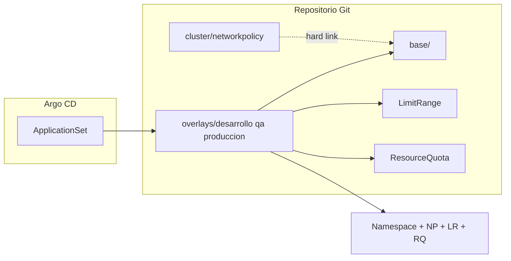

# Argo CD + Kustomize: namespaces del workshop

GitOps para provisionar los namespaces **desarrollo**, **qa** y **produccion** en OpenShift con **Kustomize** (base común + overlay por entorno) y sincronizarlos con **Argo CD**.

Los manifiestos de Argo CD (`AppProject`, `Application`, `ApplicationSet`) se documentan al final; no hay scripts ni ficheros `.yaml` de Argo en este repositorio.

**Estado**: solo estructura en Git; no aplicar al clúster hasta revisar políticas de red, cuotas y límites por entorno.

## Estructura del repositorio

```
argocd-namespaces/
├── README.md
├── bootstrap/                          # ApplicationSet → openshift-gitops (no va a overlays/)
│   ├── README.md
│   └── applicationset-workshop-namespaces.yaml
├── cluster/
│   ├── kustomization.yaml              # resources: [] (sin Application Argo por ahora)
│   └── networkpolicy-deny-all-traffic.yaml
├── base/
│   ├── kustomization.yaml              # solo NetworkPolicy (común)
│   ├── limitrange-default.yaml         # plantilla desarrollo (hard link en overlay)
│   └── networkpolicy-deny-all-traffic.yaml   # hard link → cluster/...
└── overlays/
    ├── desarrollo/
    │   ├── kustomization.yaml
    │   ├── namespace.yaml
    │   ├── limitrange.yaml             # hard link → base/limitrange-default.yaml
    │   └── resourcequota.yaml
    ├── qa/
    │   ├── kustomization.yaml
    │   ├── namespace.yaml
    │   ├── limitrange.yaml
    │   └── resourcequota.yaml
    └── produccion/
        ├── kustomization.yaml
        ├── namespace.yaml
        ├── limitrange.yaml
        └── resourcequota.yaml
```

| Capa | Contenido |
|------|-----------|
| `cluster/` | Definición **canónica** de `NetworkPolicy` deny-all (referencia: `compliance-operator/networkpolicies/02-deny-all-traffic.yaml`). No se despliega sola: `NetworkPolicy` es namespaced. |
| `base/` | `NetworkPolicy` deny-all compartida por todos los entornos. **No** incluye `LimitRange` ni `ResourceQuota` (difieren por entorno). |
| `overlays/<entorno>/` | `Namespace`, `LimitRange` y `ResourceQuota` alineados entre sí. El nombre de la carpeta = nombre del namespace en el clúster. |

No hay `RoleBinding` ni RBAC de `admin-sin-lectura-secrets` en este árbol (gestión de acceso fuera de este proyecto Argo).

## Entornos gestionados

| Overlay | Namespace | Recursos propios del overlay |
|---------|-----------|------------------------------|
| `desarrollo` | `desarrollo` | `limitrange.yaml`, `resourcequota.yaml` |
| `qa` | `qa` | `limitrange.yaml`, `resourcequota.yaml` |
| `produccion` | `produccion` | `limitrange.yaml`, `resourcequota.yaml` |

Cada overlay referencia `../../base` (NetworkPolicy) y añade su `LimitRange` + `ResourceQuota`.

## ResourceQuota por entorno

Límites agregados del namespace (`spec.hard`). Documentación: [Resource Quotas](https://kubernetes.io/docs/concepts/policy/resource-quotas/).

### desarrollo

| Recurso | Límite |
|---------|--------|
| `count/deployments.apps` | 2 |
| `pods` | 2 |
| `requests.cpu` | 1 |
| `limits.cpu` | 2 |
| `requests.memory` | 500Mi |
| `limits.memory` | 2Gi |
| `requests.storage` | 2Gi |

### qa

| Recurso | Límite |
|---------|--------|
| `count/deployments.apps` | 20 |
| `pods` | 30 |
| `requests.cpu` | 200m |
| `limits.cpu` | 1500m |
| `requests.memory` | 500Mi |
| `limits.memory` | 5Gi |
| `requests.storage` | 5Gi |

### produccion

| Recurso | Límite |
|---------|--------|
| `count/deployments.apps` | 50 |
| `pods` | 50 |
| `requests.cpu` | 200m |
| `limits.cpu` | 2 |
| `requests.memory` | 500Mi |
| `limits.memory` | 5Gi |
| `requests.storage` | 12Gi |

## LimitRange por entorno

Los `LimitRange` fijan **defaults** y **máximos por contenedor/pod/PVC** para que los pods sin `resources` definidos no rompan la cuota. Documentación: [Limit Range](https://kubernetes.io/docs/concepts/policy/limit-range/).

**Importante**: las cuotas de QA y producción permiten muchos pods con poco CPU agregado (`requests.cpu: 200m`); por eso no comparten un único `LimitRange` en `base/`.

### desarrollo (`base/limitrange-default.yaml` = `overlays/desarrollo/limitrange.yaml`)

| Tipo | defaultRequest | default | max | min |
|------|----------------|---------|-----|-----|
| Container | 500m CPU, 250Mi mem | 1 CPU, 1Gi mem | 1 CPU, 1Gi mem | 100m CPU, 128Mi mem |
| Pod | — | — | 2 CPU, 2Gi mem | — |
| PVC | — | — | 2Gi | 500Mi |

### qa

| Tipo | defaultRequest | default | max | min |
|------|----------------|---------|-----|-----|
| Container | 5m CPU, 16Mi mem | 50m CPU, 256Mi mem | 1500m CPU, 5Gi mem | 5m CPU, 16Mi mem |
| Pod | — | — | 1500m CPU, 5Gi mem | — |
| PVC | — | — | 5Gi | 1Gi |

### produccion

| Tipo | defaultRequest | default | max | min |
|------|----------------|---------|-----|-----|
| Container | 4m CPU, 10Mi mem | 50m CPU, 256Mi mem | 2 CPU, 5Gi mem | 40m CPU, 100Mi mem |
| Pod | — | — | 2 CPU, 5Gi mem | — |
| PVC | — | — | 12Gi | 1Gi |

## Política de red deny-all

Equivalente a `/opt/compliance-operator/networkpolicies/02-deny-all-traffic.yaml`:

- `podSelector: {}` → todos los pods del namespace
- `policyTypes: [Ingress]` → deniega tráfico entrante (default deny)

Se aplica en cada namespace vía `base/`. El fichero maestro está en `cluster/`; `base/networkpolicy-deny-all-traffic.yaml` es un **hard link** al mismo contenido (Kustomize no admite `resources` fuera del directorio del overlay).

Para permitir tráfico después del deny-all, añade `NetworkPolicy` adicionales en el overlay (p. ej. `03-allow-same-namespace` del compliance-operator).

## Flujo GitOps



1. **ApplicationSet** (generador `git` en `overlays/*`) crea una **Application** por entorno.
2. Cada Application ejecuta `kustomize build overlays/<entorno>/`.
3. La carpeta `cluster/` no se sincroniza sola (`kustomization.yaml` con `resources: []`).

## Añadir un namespace / entorno

1. Crear `overlays/<nombre>/` (el nombre debe ser el del namespace en el clúster).
2. Añadir `namespace.yaml` con `metadata.name: <nombre>`.
3. Crear `kustomization.yaml`:

```yaml
apiVersion: kustomize.config.k8s.io/v1beta1
kind: Kustomization
resources:
  - namespace.yaml
  - ../../base
  - limitrange.yaml
  - resourcequota.yaml
namespace: <nombre>
```

4. Definir `resourcequota.yaml` y `limitrange.yaml` **coherentes** (misma lógica de límites agregados vs defaults por pod).
5. Commit y push; el ApplicationSet crea la Application `ns-<nombre>`.

## Validación local

Sin aplicar al clúster:

```bash
kubectl kustomize /opt/workshop/automatizacion-namespace/argocd-namespaces/overlays/desarrollo
kubectl kustomize /opt/workshop/automatizacion-namespace/argocd-namespaces/overlays/qa
kubectl kustomize /opt/workshop/automatizacion-namespace/argocd-namespaces/overlays/produccion
```

Comprobar recursos generados:

```bash
kubectl kustomize .../overlays/desarrollo | grep -E '^kind:'
# Namespace, ResourceQuota, LimitRange, NetworkPolicy
```

## Repositorio Git

Remoto: [workshop-namespaces-argocd](https://github.com/alexanderbenitezbracho-web/workshop-namespaces-argocd.git), rama `main`. La raíz del repo coincide con esta carpeta (`base/`, `cluster/`, `overlays/`, `bootstrap/`).

## Bootstrap Argo CD

El **ApplicationSet** está en `bootstrap/applicationset-workshop-namespaces.yaml` y usa el **AppProject `seguridad`** ya creado en `openshift-gitops`.

```bash
oc apply -f bootstrap/applicationset-workshop-namespaces.yaml -n openshift-gitops
```

Detalle en [bootstrap/README.md](bootstrap/README.md).

## Personalización

| Objetivo | Dónde editar |
|----------|----------------|
| Deny-all en todos los entornos | `cluster/networkpolicy-deny-all-traffic.yaml` (y hard link en `base/`) |
| Cuota de un entorno | `overlays/<entorno>/resourcequota.yaml` |
| Defaults/máximos por pod de un entorno | `overlays/<entorno>/limitrange.yaml` (desarrollo: también `base/limitrange-default.yaml`) |
| Política solo en un entorno | YAML extra en `overlays/<entorno>/` |

Tras cambiar cuota, revisa el `LimitRange` del mismo overlay para que `defaultRequest`/`max` no impidan usar la cuota ni la agoten con el primer pod.

## Dependencias

- CNI con soporte de `NetworkPolicy` (OpenShift SDN/OVN).
- Argo CD / OpenShift GitOps y acceso al repositorio Git.
- Hard links (si el clon no los trae):  
  - `base/networkpolicy-deny-all-traffic.yaml` → `cluster/networkpolicy-deny-all-traffic.yaml`  
  - `overlays/desarrollo/limitrange.yaml` → `base/limitrange-default.yaml`

```bash
ln /opt/workshop/automatizacion-namespace/argocd-namespaces/cluster/networkpolicy-deny-all-traffic.yaml \
   /opt/workshop/automatizacion-namespace/argocd-namespaces/base/networkpolicy-deny-all-traffic.yaml
ln /opt/workshop/automatizacion-namespace/argocd-namespaces/base/limitrange-default.yaml \
   /opt/workshop/automatizacion-namespace/argocd-namespaces/overlays/desarrollo/limitrange.yaml
```

## Orden de despliegue recomendado (cuando aplique)

1. AppProject **`seguridad`** (ya existente en el clúster)
2. `oc apply -f bootstrap/applicationset-workshop-namespaces.yaml -n openshift-gitops`
3. Por namespace: comprobar `Namespace`, `ResourceQuota`, `LimitRange`, `NetworkPolicy` `deny-all-traffic`
