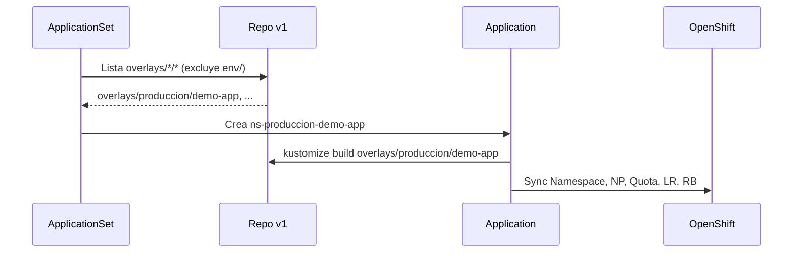

# Bootstrap Argo CD

Manifiestos que viven en el **clúster** (namespace `openshift-gitops`). No son recursos de los namespaces de los proyectos.

> **Rama Git:** toda la automatización activa usa la rama **`v1`**. La rama `main` conserva la estructura antigua (un namespace por entorno) y **no** debe usarse con este ApplicationSet.

## Contenido de `bootstrap/`

| Fichero | Recurso | Cuándo aplicarlo |
|---------|---------|------------------|
| `appproject-seguridad.yml` | `AppProject` `seguridad` | Paso 1 — antes del ApplicationSet |
| `applicationset-workshop-namespaces.yaml` | `ApplicationSet` `workshop-namespaces` | Paso 2 — genera las Applications |
| `clusterrole-base.yaml` | `ClusterRole` (referencia) | No forma parte del flujo ApplicationSet |

---

## ApplicationSet: explicación campo por campo

Manifiesto completo: [`applicationset-workshop-namespaces.yaml`](applicationset-workshop-namespaces.yaml)

```yaml
apiVersion: argoproj.io/v1alpha1
kind: ApplicationSet
metadata:
  name: workshop-namespaces
  namespace: openshift-gitops
```

| Campo | Valor | Qué hace |
|-------|-------|----------|
| `apiVersion` | `argoproj.io/v1alpha1` | Versión de la API de Argo CD para ApplicationSet. |
| `kind` | `ApplicationSet` | Recurso que **genera** Applications de forma declarativa (no las defines una a una). |
| `metadata.name` | `workshop-namespaces` | Nombre del ApplicationSet en el clúster. |
| `metadata.namespace` | `openshift-gitops` | Namespace donde OpenShift GitOps ejecuta Argo CD. |

### `spec.goTemplate` y `goTemplateOptions`

```yaml
spec:
  goTemplate: true
  goTemplateOptions: ["missingkey=error"]
```

| Campo | Valor | Qué hace |
|-------|-------|----------|
| `goTemplate: true` | Activado | Las plantillas del bloque `template:` usan sintaxis **Go template** (`{{ }}`) en lugar de la sintaxis legacy de ApplicationSet. Permite funciones como `index`. |
| `goTemplateOptions: ["missingkey=error"]` | Error si falta clave | Si una variable de la plantilla no existe (p. ej. un segmento de path mal formado), el ApplicationSet **falla** en lugar de generar un nombre vacío. Evita Applications rotas silenciosamente. |

### Generador `git` — descubrimiento de carpetas

```yaml
  generators:
    - git:
        repoURL: https://github.com/alexanderbenitezbracho-web/workshop-namespaces-argocd.git
        revision: v1
        directories:
          - path: overlays/*/*
          - path: overlays/*/env
            exclude: true
```

| Campo | Valor | Qué hace |
|-------|-------|----------|
| `generators` | Lista de generadores | Fuentes de parámetros. Cada combinación genera una Application. |
| `git.repoURL` | URL del repo | Argo CD clona este repositorio para listar directorios y sincronizar manifiestos. |
| `git.revision` | `v1` | **Rama o tag** que usa el generador para descubrir carpetas. Debe coincidir con la rama donde está la estructura nueva. |
| `directories[0].path` | `overlays/*/*` | Patrón glob: una entrada por cada subcarpeta de segundo nivel bajo `overlays/`. Ejemplo: `overlays/produccion/demo-app`. |
| `directories[1].path` | `overlays/*/env` | Carpetas base de entorno (`env/`). |
| `directories[1].exclude` | `true` | **Excluye** esas rutas del resultado. Sin esto, `overlays/desarrollo/env` generaría una Application inválida (no es un proyecto). |

**Variables disponibles por cada directorio detectado** (Go template):

| Variable | Ejemplo (`overlays/produccion/demo-app`) | Descripción |
|----------|------------------------------------------|-------------|
| `.path.path` | `overlays/produccion/demo-app` | Ruta completa en el repo. |
| `.path.basename` | `demo-app` | Nombre de la carpeta del proyecto. |
| `.path.segments[0]` | `overlays` | Primer segmento del path. |
| `.path.segments[1]` | `produccion` | **Entorno** (desarrollo, qa, produccion). |
| `.path.segments[2]` | `demo-app` | **Proyecto**. |

### Plantilla `template` — una Application por carpeta

```yaml
  template:
    metadata:
      name: 'ns-{{index .path.segments 1}}-{{.path.basename}}'
      labels:
        workshop.openshift.io/etapa: automatizacion-namespace
        workshop.openshift.io/entorno: '{{index .path.segments 1}}'
        workshop.openshift.io/proyecto: '{{.path.basename}}'
```

| Campo | Valor | Qué hace |
|-------|-------|----------|
| `metadata.name` | `ns-{{entorno}}-{{proyecto}}` | Nombre de la Application en Argo CD. Ej: `ns-produccion-demo-app`. |
| `metadata.labels` | Labels fijos + dinámicos | Etiquetan la Application en la UI y para filtros (`oc get applications -l ...`). |

```yaml
    spec:
      project: seguridad
      source:
        repoURL: https://github.com/alexanderbenitezbracho-web/workshop-namespaces-argocd.git
        targetRevision: v1
        path: '{{.path.path}}'
      destination:
        server: https://kubernetes.default.svc
        namespace: '{{index .path.segments 1}}-{{.path.basename}}'
      syncPolicy:
        automated:
          prune: true
          selfHeal: true
        syncOptions:
          - CreateNamespace=true
```

| Campo | Valor | Qué hace |
|-------|-------|----------|
| `spec.project` | `seguridad` | AppProject que autoriza repo y destinos. Debe existir antes de aplicar el ApplicationSet. |
| `source.repoURL` | Misma URL del generador | Repo del que Argo CD lee los manifiestos Kustomize. |
| `source.targetRevision` | `v1` | **Rama** que sincroniza cada Application. Debe apuntar a `v1`, no a `main`. |
| `source.path` | `{{.path.path}}` | Subdirectorio Kustomize por proyecto. Ej: `overlays/produccion/demo-app`. Argo CD ejecuta `kustomize build` ahí. |
| `destination.server` | `https://kubernetes.default.svc` | Clúster local (in-cluster). |
| `destination.namespace` | `{{entorno}}-{{proyecto}}` | Namespace destino en OpenShift. Ej: `produccion-demo-app`. Debe coincidir con `namespace:` en el `kustomization.yaml` del proyecto. |
| `syncPolicy.automated.prune` | `true` | Si quitas un recurso de Git, Argo CD lo **elimina** del clúster. |
| `syncPolicy.automated.selfHeal` | `true` | Si alguien modifica un recurso a mano, Argo CD lo **restaura** al estado de Git. |
| `syncOptions.CreateNamespace=true` | Activado | Permite crear el namespace si aún no existe. **Importante:** si falta `namespace.yaml` en el overlay, el namespace se crea **sin labels** del workshop hasta el próximo sync con el manifiesto completo. |

### Flujo resumido



---

## Applications generadas (estado actual en `v1`)

| Application | Path Git | Namespace destino |
|-------------|----------|-------------------|
| `ns-desarrollo-demo-app` | `overlays/desarrollo/demo-app` | `desarrollo-demo-app` |
| `ns-qa-demo-app` | `overlays/qa/demo-app` | `qa-demo-app` |
| `ns-produccion-demo-app` | `overlays/produccion/demo-app` | `produccion-demo-app` |

Convención: carpeta `overlays/<entorno>/<proyecto>/` → Application `ns-<entorno>-<proyecto>` → namespace `<entorno>-<proyecto>`.

Al añadir una carpeta bajo `overlays/<entorno>/<proyecto>/` y pushear a **`v1`**, el ApplicationSet crea la Application en el próximo refresh (~3 min) sin editar este manifiesto.

---

## Paso a paso: implementar desde cero

Asume OpenShift GitOps instalado y sesión `oc` como admin.

### Paso 0 — Clonar y usar solo `v1`

```bash
git clone https://github.com/alexanderbenitezbracho-web/workshop-namespaces-argocd.git
cd workshop-namespaces-argocd
git checkout v1
```

Verificar que estás en `v1`:

```bash
git branch --show-current
# v1
```

### Paso 1 — Comprobar OpenShift GitOps

```bash
oc project openshift-gitops
oc get pods
```

Todos los pods relevantes deben estar `Running`. Si `openshift-gitops-applicationset-controller` está `Pending` por CPU, reducir réplicas de otros componentes o bajar el `resources.requests.cpu` del deployment.

### Paso 2 — Aplicar AppProject `seguridad`

```bash
oc apply -f bootstrap/appproject-seguridad.yml
oc get appproject seguridad -n openshift-gitops
```

El AppProject autoriza al ApplicationSet a desplegar desde el repo hacia cualquier namespace.

### Paso 3 — Validar overlays localmente (opcional pero recomendado)

```bash
kubectl kustomize overlays/desarrollo/demo-app
kubectl kustomize overlays/qa/demo-app
kubectl kustomize overlays/produccion/demo-app
```

Cada build debe incluir: `Namespace`, `ResourceQuota`, `LimitRange`, `RoleBinding`, 2× `NetworkPolicy`.

### Paso 4 — Aplicar ApplicationSet

```bash
oc apply -f bootstrap/applicationset-workshop-namespaces.yaml
oc get applicationset workshop-namespaces -n openshift-gitops
```

### Paso 5 — Esperar Applications y sync

```bash
# Listar Applications (recurso argoproj.io)
oc get applications.argoproj.io -n openshift-gitops

# Estado detallado
oc get applications.argoproj.io -n openshift-gitops \
  -o custom-columns='NAME:.metadata.name,SYNC:.status.sync.status,HEALTH:.status.health.status,REV:.status.sync.revision'
```

Deben aparecer 3 Applications en estado `Synced` / `Healthy`.

Forzar refresh si no sincroniza:

```bash
oc patch application.argoproj.io ns-produccion-demo-app -n openshift-gitops \
  --type merge -p '{"metadata":{"annotations":{"argocd.argoproj.io/refresh":"hard"}}}'
```

### Paso 6 — Verificar namespaces en el clúster

```bash
oc get ns -l workshop.openshift.io/etapa=automatizacion-namespace --show-labels

oc get networkpolicy,resourcequota,limitrange -n produccion-demo-app
```

Labels esperados en cada namespace:

```
workshop.openshift.io/entorno=<desarrollo|qa|produccion>
workshop.openshift.io/etapa=automatizacion-namespace
workshop.openshift.io/proyecto=<nombre-proyecto>
app.kubernetes.io/managed-by=argocd
```

### Paso 7 — UI de Argo CD

Ruta (varía por clúster):

```bash
oc get route openshift-gitops-server -n openshift-gitops -o jsonpath='https://{.spec.host}{"\n"}'
```

Usuario `admin` tiene rol admin vía `argocd-rbac-cm` (`u, admin, role:admin`).

---

## Teardown — borrar todo para repetir el paso a paso

Ejecutar en orden:

```bash
# 1. Eliminar ApplicationSet (elimina las Applications hijas)
oc delete applicationset workshop-namespaces -n openshift-gitops

# 2. Verificar que no queden Applications del workshop
oc get applications.argoproj.io -n openshift-gitops

# 3. Eliminar namespaces creados
oc delete ns desarrollo-demo-app qa-demo-app produccion-demo-app --wait=false

# 4. (Opcional) Eliminar AppProject
oc delete appproject seguridad -n openshift-gitops
```

Luego repetir desde el **Paso 2** (o Paso 4 si mantienes el AppProject).

---

## Errores frecuentes

| Síntoma | Causa | Solución |
|---------|-------|----------|
| Namespace sin labels del workshop | Falta `namespace.yaml` o `components: [../env/labels]` en el proyecto | Copiar plantilla completa de `demo-app` |
| Application `Synced` pero namespace vacío de labels | Solo existía `kustomization.yaml` incompleto; `CreateNamespace=true` creó NS antes del manifiesto | Completar overlay y forzar refresh |
| ApplicationSet no genera apps | Controller pod `Pending` o repo apunta a `main` | Verificar pod y `revision: v1` |
| `kustomize build` falla | Falta `namespace.yaml` referenciado en resources | Crear `namespace.yaml` |
| Labels en NP pero no en Namespace | Normal si falta el Component `env/labels` | Añadir `components: [../env/labels]` |

---

## Repo privado

Si el repositorio es privado, registrar credenciales en Argo CD **antes** del sync:

```bash
oc apply -f <secret-repo> -n openshift-gitops
```
